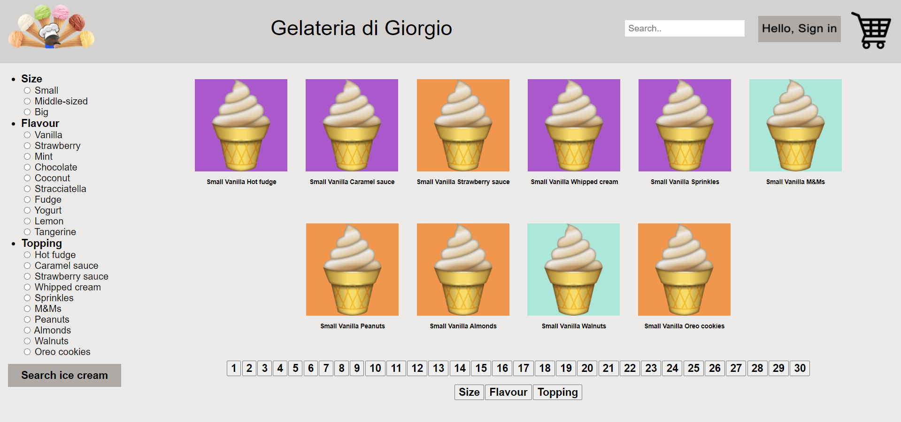
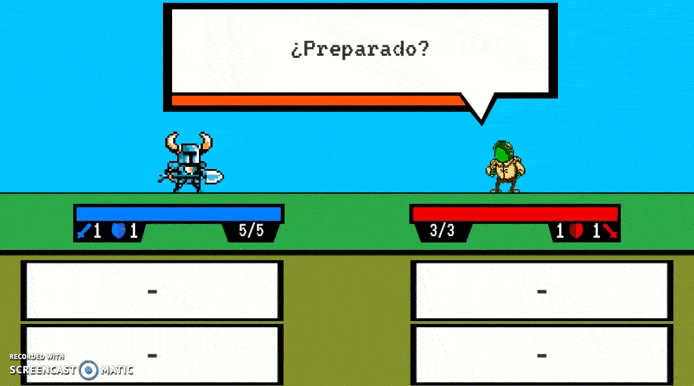
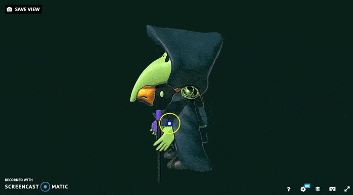
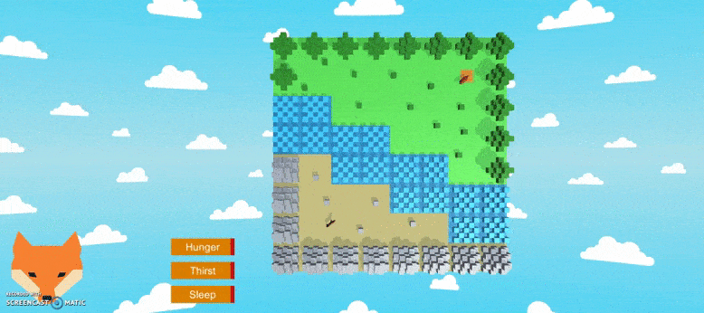
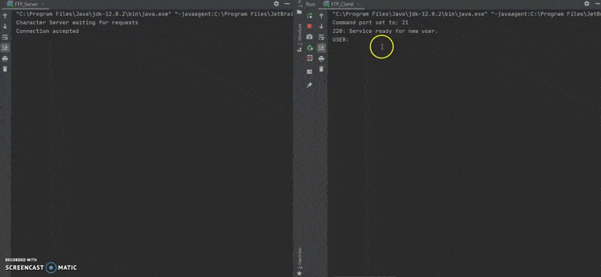
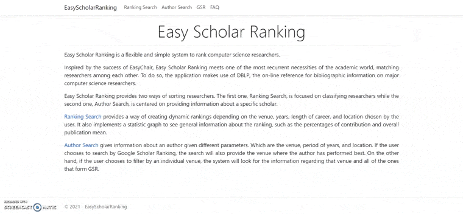

## Portfolio

---

## 2016
### Battle Royale

- 2 player local fighting game - GameMaker Studio

---

## 2017
### Gluttonous Wompa

- Fast paced snake in a round world - Unity

---

## 2018
### Pack Like an Egyptian

- Classic vertical shooter with octodirectional shooting - LibGDX

---

## 2019
### Gelateria di Giorgio

- Ice cream e-commerce platform - PHP

### Knights of PI

- Procedural question generator math game - Unity

---

## 2020
### Cyberpunk Environment

- Low poly environments textured with color palettes - Maya, Sketchfab

### Plague Knight

- Fully modeled 3D character - Maya, ZBrush, Sub. Painter, Sketchfab

### Fox AI

- Simple NPC using planning, pathfinding and behavior trees - Unity

### FTP System

- FTP client and server system - Java

---

## 2021
### Easy Scholar Ranking

- Web application to search and rank software investigators - ASP.NET

### Waterpolo Game

- Waterpolo android game - Unity

---

Page template forked from <a href="https://github.com/evanca/quick-portfolio">evanca</a>

<!-- Remove above link if you don't want to attibute -->
